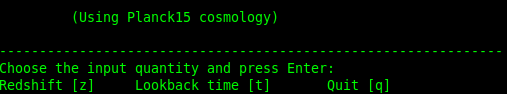

# utils-interactive-cosmo
Simple interactive python code to compute cosmological related quantities.

It uses astropy, specially the `Planck15` cosmology object, based on [Planck Collab 2015, Paper XIII](https://arxiv.org/abs/1502.01589)


## Running the code
For now there is just `z_an_time.py`, to run it, simply execute:

```
python z_and_time.py
```
You will get the following message:


Then just press the key accordingly for your calculations.
